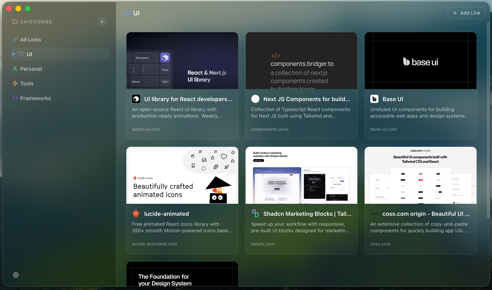

# Tote

A beautiful link collection app for macOS built with Tauri, React, and TypeScript. Save, organize, and browse your favorite links with automatic metadata extraction.



## Features

- 📁 **Categories** - Organize links into customizable categories
- 🔗 **Link Metadata** - Automatically fetches titles, descriptions, icons, and preview images
- 🎨 **Glassmorphic UI** - Native macOS vibrancy effects with a modern design
- ⚡ **Fast** - Built with Rust and Tauri for native performance
- 🔍 **Search** - Quickly find links across all categories

## Tech Stack

- **Frontend**: React 19, TypeScript, TanStack Router, TanStack Query
- **Backend**: Tauri 2, Rust
- **Styling**: Vanilla CSS with CSS Variables

## Getting Started

### Prerequisites

- Node.js (v18+)
- Rust toolchain
- pnpm

### Development

```bash
# Install dependencies
pnpm install

# Run in development mode
pnpm tauri dev
```

### Build

```bash
# Build for production
pnpm tauri build
```

## Project Structure

```
src/
├── components/      # React components
├── routes/          # TanStack Router pages
├── hooks/           # Custom React hooks
├── lib/             # Utilities and services
├── styles/          # CSS stylesheets
└── types/           # TypeScript types
```

## License

MIT
